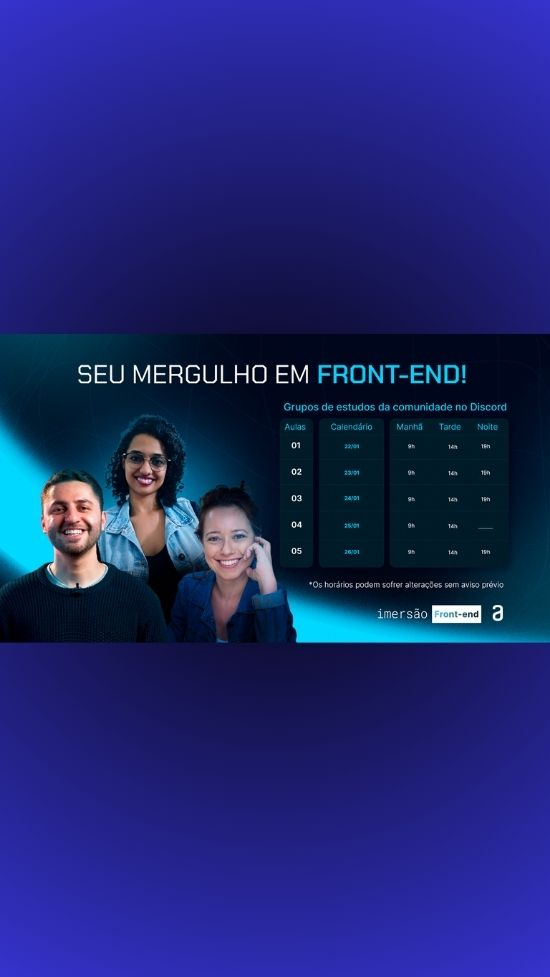

<h1 align="center">Projeto_Imersao_FrontEnd_e_Alura</h1>

 Imersão Front-end.  
<a href="https://cursos.alura.com.br/imersao">Estude esse projeto em formato de vídeo clicando aqui.</a>

  <a href="#-tecnologias">Tecnologias</a>&nbsp;&nbsp;&nbsp;|&nbsp;&nbsp;&nbsp;
  <a href="#-projeto">Projeto</a>&nbsp;&nbsp;&nbsp;|&nbsp;&nbsp;&nbsp;
  <a href="#memo-licença">Licença</a>

  

 

  

## 🚀 Tecnologias

Esse projeto foi desenvolvido com as seguintes tecnologias:

- HTML e CSS
- JavaScript
- Git e Github
- A.I / Chat GPT

## 💻 Projeto

O nosso projeto é a recriação da página inicial do Spotify por meio do HTML e do CSS.

Tecnolgias:
VSCode;
HTML, CSS e JavaScript;
Abordamos o código do menu lateral e aprofundamos em CSS, explorando posicionamento, layouts e a técnica do Flexbox

Nesta aula, você vai:
Criamos todo menu lateral da página;
Usamos fundamentos do CSS Flexbox;
Posicionamentos no CSS.
Usamos o ChatGPT.

Em seguida nos concentramos na estrutura do código, fomos mais a fundo no CSS, mexendo com as variáveis; entendendo conceitos de responsividade e, também, criando o menu superior.

Na etapa seguinte estruturamos melhor o projeto;
Refatoramos o código;
Fizemos o layout flexbox;
Usamos conceitos de responsividade;
Criaamos o menu superior.
Mais uma vez usamos o chat GPT.

Nesse momento utilizamos o CSS Grid no projeto, para os cards da página inicial, aprendendo as medias queries, além de introduzir o JavaScript com o conceito DOM e o método promises.

Aqui nessa etapa criamos cards da página inicial;
Aprendemos a usar o CSS Grid Layout;
Utilizamos media queries para responsividade;
Instalamos do Node.js;
Introduzimos o JavaScript no projeto;
Utilizamos o conceito DOM;
Conhecemos o método Promises do JavaScript.

Nesse projeto recebemos vários insights e orientações exclusivas para impulsionar o aprendizado de forma eficaz com o uso do ChatGPT, isso foi incrível.

Foi uma experiÊncia incrível, deixando com mais desejo de continuar a explorar esse mundo da programação!

QUEM SÃO OS MERGULHADORES?
INSTRUTORES E INSTRUTORAS DA ALURA NESSA IMERSÃO:

-Guilherme Lima;

-Fernanda Degolin
Desenvolvedora Front-end na Globo;

Mayara Cardoso
Desenvolvedora Front-end no Itaú

- [Acesse o projeto finalizado, online](xx)

- [Assistir aulas](https://www.alura.com.br/apostila-html-css-javascript/)

## 🔖 Layout

Inspirado no site Oficial Spotify.

## :memo: Licença

Esse projeto está sob a licença MIT.

---

=====================================#ImersãoFrontEnd e #Alura====================================